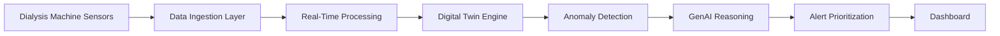

# genai-digital-twin-dialysis
Generative AI digital twin for predictive monitoring and safety optimization of dialysis machines in healthcare environments.

  
  
  

   

#  Generative Digital Twin for Safer Dialysis Machines

**Domain:** Healthcare
**Focus Area:** AI-driven Medical Equipment Safety & Predictive Monitoring
**Theme:** Generative AI / Digital Twin Systems

##  Overview

Dialysis treatment depends on complex medical machines that must operate continuously and precisely to ensure patient safety. Machine failures, alarm overload, contamination risks, and operational errors can interrupt treatment and increase clinical workload.

This project proposes a next-generation **Generative AI–powered Digital Twin system** that simulates dialysis machine behavior in real time, predicts failures, prioritizes alerts, and generates actionable guidance for healthcare staff. The goal is to shift monitoring from reactive responses to proactive intelligence.

##  Problem Statement

Dialysis machines frequently produce excessive alarms, encounter mechanical or sensor failures, and face environmental risks such as water contamination. These challenges can lead to treatment interruptions, alarm fatigue among staff, and increased risk of patient complications.

Current monitoring solutions primarily respond to faults after they occur, lacking predictive insight or intelligent prioritization. A proactive system capable of forecasting failures and guiding operators is needed to improve safety and efficiency.

##  Motivation

Healthcare environments demand reliability, yet clinicians must interpret large volumes of machine signals under time pressure. This increases cognitive burden and the likelihood of delayed responses or human error.

Advances in Generative AI and digital twin modeling enable real-time simulation and predictive reasoning. Leveraging these technologies can enhance patient safety, reduce workload, and provide intelligent support in critical medical workflows.

##  Application

The solution is intended for deployment in hospitals or dialysis centers. It will:

* Create real-time digital replicas of dialysis machines
* Monitor sensor and operational data
* Predict faults and maintenance needs
* Prioritize alarms based on severity
* Generate step-by-step guidance for staff

### Target Users

* Dialysis technicians
* Biomedical engineers
* Clinical support staff

##  Proposed Method

* Real-time sensor data ingestion
* Digital twin simulation of machine behavior
* Machine learning–based anomaly detection
* Generative AI for alert interpretation and guidance
* Retrieval-based reasoning using manuals and protocols

### Suggested Technology Stack

* Python / FastAPI
* Stream processing pipelines
* Vector databases
* Transformer-based language models
* Dashboard UI visualization

##  Datasets / Data Sources

* Historical machine telemetry logs
* Sensor streams (pressure, flow, water quality, power signals)
* Maintenance and incident records
* Technical manuals and safety documentation
* Synthetic simulated failure scenarios

##  Experiments & Evaluation

* Evaluate fault prediction accuracy
* Measure alarm reduction rates
* Assess staff response-time improvements
* Simulation with historical data
* Usability feedback
**Metrics**
* Precision / Recall
* Mean Time-to-Failure Prediction
* Alert prioritization accuracy
* Efficiency improvement

## 🚀 Novelty & Scalability

**Novel Contributions**

* Integration of generative reasoning with digital twin simulation
* Dynamic workflow generation
* Predictive monitoring instead of reactive alerts

**Scalability**

* Extension to other medical devices
* Multi-hospital deployment
* Smart healthcare integration
  
##  System Architecture

## Workflow

1. Collect sensor data
2. Stream and process
3. Update digital twin
4. Detect anomalies
5. Generate alerts
6. Guide staff actions

##  Elevator Pitch

A Generative AI digital twin system that predicts dialysis machine failures, prioritizes alarms, and assists clinical staff with actionable guidance — improving safety and treatment reliability.
